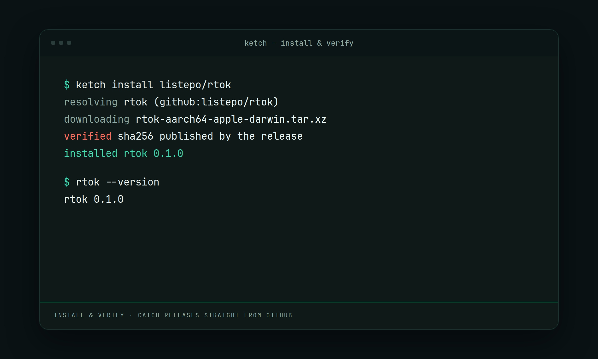
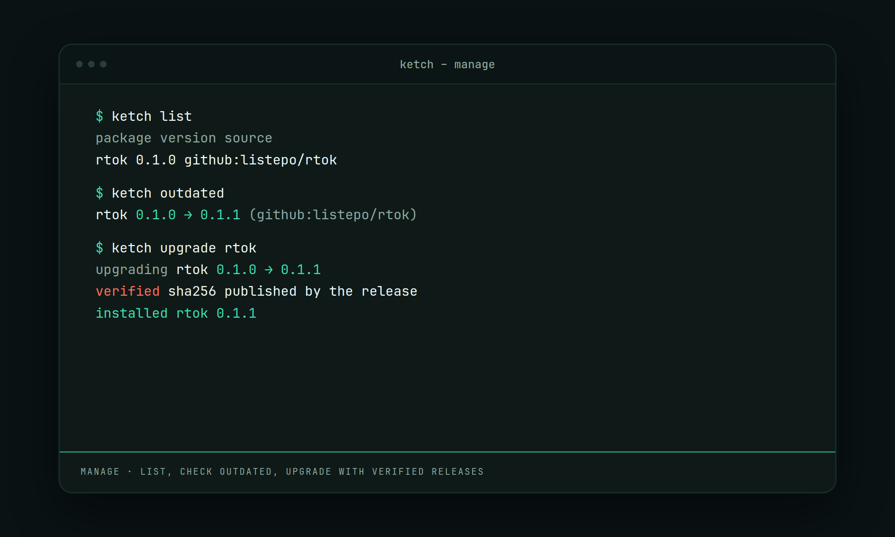

<div align="center">


# ketch

**Install any CLI tool or app straight from its GitHub releases — no formula, checked against the published checksum, versioned, and cleanly removable.**

[](#license)

[](https://github.com/pyrlyn/ketch/releases/latest)
[](https://github.com/pyrlyn/ketch/actions/workflows/ci.yml)
[](https://github.com/pyrlyn/ketch/actions/workflows/pages.yml)
<br>
[](https://sonarcloud.io/summary/new_code?id=listepo_ketch) [](https://sonarcloud.io/component_measures?id=listepo_ketch&metric=coverage) [](https://sonarcloud.io/component_measures?id=listepo_ketch&metric=tests)

**Catch releases straight from GitHub.**

Install command-line tools and apps from GitHub releases on macOS, Linux, and Windows.
No taps, no formulae, no build step — ketch downloads what a project already
ships, verifies it, and puts it on your `PATH`.

[Website](https://pyrlyn.github.io/ketch/) ·
[Documentation](https://pyrlyn.github.io/ketch/docs/) ·
[Registry](https://github.com/pyrlyn/ketch-registry) ·
[Roadmap](ROADMAP.md)

</div>

---

## Quick start

```bash
curl -fsSL https://raw.githubusercontent.com/pyrlyn/ketch/main/install.sh | bash
ketch install BurntSushi/ripgrep     # any repo that publishes releases
ketch why rg                         # how it was resolved, and which asset won
```

On Windows, install ketch with
`irm https://raw.githubusercontent.com/pyrlyn/ketch/main/install.ps1 | iex`;
the other commands are the same. `ketch list local` shows what you have.

A package can be named several ways:

```bash
ketch install BurntSushi/ripgrep     # any repo that publishes releases
ketch install rg                     # or a name ketch already knows
ketch install sharkdp/fd@v10.2.0     # or an exact version
ketch install --path ./mytool        # a local binary, archive, symlink, or .app
ketch install local:/abs/or/rel      # same thing, as a package ref
```

## Demo

**Install & verify.** `ketch install pyrlyn/rtok` downloads the release, checks
the published SHA-256, and leaves the binary on your `PATH`.



**Manage.** `ketch list`, `ketch outdated`, and `ketch upgrade` keep installed
tools current — each upgrade is verified the same way.



## Why ketch

Most command-line tools are already published as a release asset built for your
machine. A package manager does not need to compile them, and a maintainer does
not need to write a formula for them — the artefact is right there. ketch picks
the right one, checks the checksum the project published, unpacks it into a
versioned store, and links it onto your `PATH`.

- **Any repo that ships releases.** No formula, no tap, no waiting for a
  maintainer. Point it at `owner/repo`.
- **Verified, not just downloaded.** Published SHA-256 sums are checked against
  what landed on disk. `require_checksums` refuses anything that publishes none,
  and ketch's own updates never accept trust-on-first-use.
- **Apps as well as binaries.** An `.app` bundle goes to `/Applications`,
  quarantine cleared when the signature checks out, removed cleanly on
  uninstall.
- **One tree.** Everything under `~/.ketch`. Uninstalling leaves nothing behind.
- **Sources beyond GitHub.** A plugin is one executable that answers in JSON —
  no recompile, no ketch release.

## Highlights

| | |
| --- | --- |
| **Explains its choices** | `ketch why <pkg>` traces a resolution without installing; `ketch info <pkg> --assets` lists every release asset with its score and the reason. |
| **Checksums and signatures** | SHA-256 from the release's checksum files or GitHub's own asset digest. A manifest's `trust` table requires a publisher signature — sigstore, minisign or gpg — and a release without it is refused. See [docs/MANIFESTS.md](docs/MANIFESTS.md). |
| **Rollback without a re-download** | An upgrade keeps the previous version on disk; `ketch rollback <pkg>` relinks it. |
| **Reproducible machines** | `ketch lock` writes `ketch.lock`; `ketch sync` installs exactly what it names. |
| **Fast batches** | Downloads run four at a time by default (`--jobs N`). |
| **History that outlives packages** | `ketch history` and `ketch stats` read an append-only `stats.db`. |
| **Changelogs on demand** | `ketch changelog <pkg>` shows the shipped `CHANGELOG.md` entry, or the release notes. |
| **Manages itself** | ketch is one of its own packages: `ketch self upgrade`, `ketch self uninstall`. |

## How it compares

Every tool below is good at what it was built for; this is where ketch sits
among them. Checked against each project's documentation in September 2026.

| | ketch | Homebrew | apt | mise |
| --- | --- | --- | --- | --- |
| Needs a formula or package written first | No — any `owner/repo` with release assets; a manifest only when inference picks wrong | Yes — a formula or cask, in core or a tap | Yes — a `.deb` in a configured repository | No for `github:` / `aqua:` backends; short names come from its registry |
| Platforms | macOS, Linux, Windows | macOS, Linux | Debian-family Linux | macOS, Linux, Windows |
| Verification by default | SHA-256 when the release publishes one (checksum file or GitHub asset digest); publisher signature when the manifest declares `trust` | SHA-256 pinned in every formula | Signed repository metadata plus per-package hashes | Checksums when recorded (config or `mise.lock`); GitHub attestations and SLSA provenance when the release has them |
| Versioned store with rollback | Yes — previous version retained; `ketch rollback` relinks it | Old versions stay until `brew cleanup`; no rollback command | No — downgrade only if the old version is still available | Versions side by side; switch with `mise use tool@version` |
| Clean uninstall | `ketch uninstall`; `ketch self uninstall` removes the whole `~/.ketch` tree and its PATH block | `brew uninstall` (`--zap` for cask leftovers) | `apt purge` removes the package and its config files | `mise uninstall`; `mise implode` removes mise itself |
| Builds from source | Never | When no bottle fits | Never (binary packages) | Some backends do |

Where ketch is the odd one out: `.app` bundles into `/Applications`, an
explanation for every asset it picks, and a store it can roll back without
touching the network.

## Install

```bash
curl -fsSL https://raw.githubusercontent.com/pyrlyn/ketch/main/install.sh | bash
```

On Windows:

```powershell
irm https://raw.githubusercontent.com/pyrlyn/ketch/main/install.ps1 | iex
```

or with Homebrew:

```bash
brew install --cask pyrlyn/tap/ketch
```

Either way ketch ends up in `~/.ketch`, installed as one of its own packages:
`ketch list` shows it, and `ketch self upgrade` upgrades it like anything else.
The curl and PowerShell installers run `ketch self install`, then `ketch path
install`, and place a bootstrap copy at `--install-dir` when you give one.
Homebrew keeps nothing but the bootstrap binary, and `brew upgrade` hands over
to `ketch self upgrade`.

With [mise](https://mise.jdx.dev), no installer runs; the release tarball is
the whole install:

```bash
mise use -g github:listepo/ketch
ketch path install
```

mise then owns the binary: `mise upgrade` upgrades it, and `ketch self upgrade`
refuses to rewrite a file in mise's tree. Run `ketch self install` as well if
you would rather ketch manage itself, as with the installers above.

Then make sure `~/.ketch/bin` is on your `PATH`. `ketch doctor` will tell you if
it is not, along with anything else that needs attention.

To remove it again:

```bash
ketch self uninstall
```

That takes everything with it — every package ketch installed, the whole
`~/.ketch` tree, the `PATH` block in your shell startup files, the user PATH on
Windows, and the Homebrew
cask if that is how ketch arrived. It lists what it is about to delete and asks
first, because none of it can be recovered afterwards. `--keep-packages` removes
only ketch and leaves the tools it installed alone.

`brew uninstall --cask ketch` removes only the bootstrap binary Homebrew kept;
everything under `~/.ketch` and every package ketch installed stays until you
run `ketch self uninstall` (or delete the tree yourself). The same holds for
`mise unuse -g github:listepo/ketch`. Run from a mise install, `ketch self
uninstall` asks, separately, whether to run that command for you as well.

## Usage

```bash
ketch install sharkdp/bat            # install from any owner/repo
ketch why bat                        # explain the resolution, install nothing
ketch info bat --assets              # every release asset, its score and why
ketch upgrade                        # bring everything unpinned up to date
ketch rollback bat                   # back to the previous version, no download
ketch lock                           # record this machine in ./ketch.lock
ketch sync                           # make another machine match it
ketch self upgrade                   # upgrade ketch itself
ketch uninstall bat                  # remove it, links and all
```

### Every command

```bash
ketch install <pkg>...     # install; concurrent by default, --jobs N to change
ketch install --path PATH  # install a local archive, binary, symlink, or .app
ketch list                 # installed and available, with latest versions
ketch list local           # what is installed; no network
ketch list remote          # what the registry offers
ketch outdated             # what has a newer release
ketch upgrade              # bring everything unpinned up to date
ketch rollback <pkg>       # restore the previous retained version (`--to` for an older one)
ketch prune [pkg]          # apply the retention policy; upgrade never deletes a prefix
ketch info <pkg>           # details, including --assets and why each scored
ketch why <pkg>            # explain a resolution without installing
ketch search <query>       # GitHub, and any source plugin that can search
ketch changelog <pkg>      # what changed: the shipped file, or the release notes
ketch update               # refresh the package registry
ketch pin / unpin <pkg>    # hold a version, or let go
ketch link <pkg>...        # re-create links for installed packages
ketch unlink <pkg>...      # remove links, keep the installed package
ketch uninstall <pkg>...   # remove it
ketch lock                 # write ketch.lock from what is installed
ketch sync                 # install what ketch.lock names, at those versions
ketch doctor               # check the environment and the install tree
ketch doctor --fix         # and repair the PATH setup while it is there
ketch path                 # show PATH setup (same as `path status`)
ketch path install         # put ~/.ketch/bin on PATH
ketch config create        # write a ketch.toml by answering questions
ketch registry push        # offer it to the registry, showing the diff first
ketch registry validate    # check a registry tree the way the pre-push hook does
ketch registry status      # age and source of the local copy; no network
ketch self version         # print version, target, root and binary path
ketch self upgrade         # upgrade ketch itself
ketch self uninstall       # remove ketch and everything it installed
```

[docs/COMMANDS.md](docs/COMMANDS.md) has every command with a working example;
[ketch list](docs/COMMANDS.md#ketch-list) explains its three modes, the
`update available` and `?` markers, and the JSON each mode prints.

## The store and rollback

Everything lives under `~/.ketch`: versioned payloads in `store/`, links in
`bin/`, a `state.json` recording what is installed, and a `stats.db` recording
what happened. Nothing is written outside that tree except the `.app` bundles
that belong in `/Applications`, the user man and completion directories `ketch
doctor` reports, the shell startup file `ketch path install` edits when you
ask it to, `./ketch.lock` and `./ketch.toml` when you ask for them, and the
running binary itself when `ketch self upgrade` replaces it in place outside the
store.

An upgrade keeps the previous prefix on disk and records it under `retained`
in `state.json`, together with a `retention` policy (`keep`, default 1).
`ketch rollback <pkg>` relinks that prefix — it never re-downloads. `ketch prune`
is the only command that deletes retained prefixes; it leaves `keep` previous
versions. `ketch list` and `ketch info` show what is still retained. State files
written before this field existed still load: missing `retention` means keep 1,
and missing `retained` means none.

## Installing from disk

`ketch install --path PATH` (or `ketch install local:PATH`) installs something
already on this machine: a bare binary, a symlink to one, an archive, or an
`.app` bundle. The path is recorded in absolute form, the original is never
touched, and uninstalling removes only ketch's copy. A single file is linked
under the package name, which comes from the file name unless `--name` says
otherwise:

```bash
ketch install --path ./target/release/mytool --name mytool
```

A local package has no releases: it records the version `0.0.0-local`,
`outdated` and `upgrade` skip it, and installing the same path again with
`--force` picks up a rebuilt file. There is no published checksum to require,
so `require_checksums` does not apply to it. `ketch lock` records the hash of
what was there, and `sync` refuses the path if its contents have changed since.

`--name` works for any single package, not only a local one, and `upgrade` and
`sync` keep the name it chose.

## What you had, and when

```bash
ketch history              # every install, upgrade and removal, newest first
ketch history rg           # just this package's versions, including old ones
ketch stats                # how many installs, how long they take
```

`state.json` says what is installed now and is rewritten on every change, so it
cannot answer which version you had in March. `stats.db` is the other half: an
append-only record that outlives the packages themselves, which is why
`ketch history rg` still works after `ketch uninstall rg`. Delete the file and
you lose the history, never the packages.

## Seeing what changed

```bash
ketch changelog rg            # the entry for the version you have
ketch changelog rg --latest   # the release you would get by upgrading
ketch changelog rg --release  # the notes on the release, not the shipped file
```

Most releases carry their history twice: a `CHANGELOG.md` inside the archive
and the notes attached to the release. ketch prefers the file — it is already
on disk, so this works with no network — and falls back to the notes when the
file has no entry for that version, which is what happens whenever a project
tags before writing the heading.

The changelog goes to stdout and everything else to stderr, so
`ketch changelog rg > NOTES.md` leaves nothing but the markdown.

## Installing several at once

```bash
ketch install rg fd bat jq      # four downloads at a time, four progress bars
ketch install rg fd --jobs 1    # one at a time
```

Downloads run concurrently by default and spend their time waiting, so a batch
takes about as long as its slowest package rather than the sum of all of them.
Only the downloading and unpacking overlap: packages are placed into the store
one at a time, in whatever order each download finishes — not necessarily the
order you asked for them. Exit status and printed results still follow your
request order.

`upgrade` and `sync` work the same way. `--jobs N` sets the width for any of
them; `jobs` in the config file sets the default.

## The log

Every run is written to `~/.ketch/logs/ketch.log` — including the lines
`--quiet` swallowed and the debug detail `--verbose` would have shown. A failed
command prints where to find it.

```
2026-08-27T09:12:33Z [4218] INFO  ketch 0.1.0 · install rg fd
2026-08-27T09:12:34Z [4218] ERROR HTTP 404 from https://api.github.com/...
```

Set `log_format = "json"` for JSON Lines instead, `log_level` to `debug` for
everything or `off` for nothing. The file rotates to `ketch.log.1` at 5 MiB, so
it never needs pruning by hand. `ketch doctor` prints where it is and how big
it has grown.

## Reproducing a machine

```bash
ketch lock            # write ./ketch.lock from what is installed
ketch lock --check    # has anything drifted?
ketch sync            # make this machine match the lockfile
```

Commit `ketch.lock` next to your dotfiles and a new machine is one command
behind the old one. The tag is what reproduces everywhere; the recorded
checksum is enforced on a machine of the same target, and elsewhere ketch picks
the asset that fits and verifies it against the source. `--prune` removes what
the lockfile does not name, `--dry-run` shows the plan first. See
[docs/LOCKFILE.md](docs/LOCKFILE.md).

## Getting on PATH

```bash
ketch path              # show PATH setup (same as `path status`)
ketch path status       # which shells are set up, and where
ketch path install      # edit the ones you use
ketch path uninstall    # take the block back out
```

On Unix it detects bash, zsh and fish — the shell `$SHELL` names, plus any whose
startup file you already keep — and writes one block between markers, so it can
rewrite it if the root moves and remove it cleanly later. On Windows it writes
the user PATH, which every new terminal reads. `--shell <name>` picks a Unix
shell, `--all` takes every target ketch knows, `--dry-run` shows the edit
without making it, and `--print` gives you the line to paste somewhere ketch
does not know about.

A line you added yourself is left alone rather than duplicated. `ketch doctor`
reports the PATH as a failure when no shell knows about it, as a warning when a
startup file has it but the current shell predates the edit, and `ketch doctor
--fix` does the setup for you.

## How a package is found

A name is resolved against four tiers, in order:

1. your own manifests in `~/.ketch/manifests/`
2. the fetched package registry — see [docs/REGISTRY.md](docs/REGISTRY.md)
3. the registry compiled into the binary, so common tools work offline
4. inference from `owner/repo`, which is what makes an uncurated repository
   installable with no manifest at all

Inference picks the release asset that matches your machine — architecture,
OS, and libc — and explains its choice under `ketch info --assets`.

When it guesses wrong, a manifest says what to do instead: which asset, which
binaries, under what names. See [docs/MANIFESTS.md](docs/MANIFESTS.md).

Sources other than GitHub are added as plugins — a single executable, no ketch
release required. See [docs/PLUGINS.md](docs/PLUGINS.md).

## Configuration

`~/.ketch/config.toml`, with environment variables taking precedence:

| Key | Environment | Default |
| --- | --- | --- |
| `apps_dir` | `KETCH_APPS_DIR` | `/Applications` |
| `github_token` | `KETCH_GITHUB_TOKEN`, `GITHUB_TOKEN`, `GH_TOKEN` | none |
| `prerelease` | `KETCH_PRERELEASE` | `false` |
| `allow_emulation` | `KETCH_ALLOW_EMULATION` | `true` |
| `link_apps` | `KETCH_LINK_APPS` | `false` |
| `require_checksums` | `KETCH_REQUIRE_CHECKSUMS` | `false` |
| `strip_quarantine` | `KETCH_STRIP_QUARANTINE` | `true` |
| `auto_update` | `KETCH_AUTO_UPDATE` | `true` |
| `emoji` | `KETCH_EMOJI` | `true` |
| `registry` | `KETCH_REGISTRY` | `pyrlyn/ketch-registry` |
| `self_repo` | `KETCH_SELF_REPO` | `listepo/ketch` |
| `jobs` | `KETCH_JOBS` | `4` (capped at `16`) |
| `log_level` | `KETCH_LOG_LEVEL` | `info` |
| `log_format` | `KETCH_LOG_FORMAT` | `text` |

[docs/config.schema.json](https://github.com/pyrlyn/ketch/blob/main/docs/config.schema.json) is the file's JSON Schema,
generated from the types ketch reads it into, for editors and linters.

To start over, `ketch config reset` writes `config.toml` with those defaults
(after asking, unless `--yes`). The existing file is backed up beside itself
as `config.toml.bak-<unix-seconds>`, unless it is missing or already matches a
sibling backup:

```bash
ketch config reset          # ask, back up, write the defaults
ketch config reset --yes    # for scripts and CI
```

`auto_update` (default `true`) runs `ketch update` at the start of `install` and
`upgrade`. Set it to `false`, or `KETCH_AUTO_UPDATE=false`, to skip the registry
refresh.

`emoji` (default `true`) puts an icon in front of each status line on a
terminal: 📦 install, ⏫ upgrade, 🧹 uninstall, ⏬ download, 🔗 link, ⏪ rollback,
✅ success, ❗ warning, ❌ error, 💡 note. Set it to `false`, or
`KETCH_EMOJI=0`, or pass `--no-emoji`, to go without. Icons never reach a pipe,
`TERM=dumb`, `--json` output or the log.

The root itself is `KETCH_ROOT` or `--root`; it cannot be set from the config
file, because the file lives inside it. `KETCH_GITHUB_API` overrides the GitHub
API base URL (for Enterprise); it cannot be set from the config file either.
`jobs` and `--jobs` above `16` are clamped to `16`.

A token is not required, but it raises GitHub's rate limit considerably.

## Platform support

macOS, Linux and Windows. Each OS has a `Platform` backend that picks a release
asset, unpacks it and places binaries; everything above that trait is shared.
`cargo test` runs the suite for the host OS; CI does that on macOS, Linux and
Windows. Install paths: `curl | bash` via `install.sh` on macOS and Linux,
`irm | iex` via `install.ps1` on Windows, or `brew install --cask pyrlyn/tap/ketch`
on macOS. `ketch path install` puts `~/.ketch/bin` on PATH (shell startup files
on Unix; the user PATH on Windows). Releases publish a tarball per target;
`install.sh` and `install.ps1` fetch the one for the machine they run on. The
Homebrew tap is [`pyrlyn/homebrew-tap`](https://github.com/pyrlyn/homebrew-tap);
the package registry is [`pyrlyn/ketch-registry`](https://github.com/pyrlyn/ketch-registry).

## Documentation

| | |
| --- | --- |
| [docs/COMMANDS.md](docs/COMMANDS.md) | Every command: what it does, and one working example |
| [docs/MANIFESTS.md](docs/MANIFESTS.md) | The package config: every field, and when you need one |
| [docs/REGISTRY.md](docs/REGISTRY.md) | The registry layout, and how to add a package to it |
| [docs/PLUGINS.md](docs/PLUGINS.md) | The source-plugin protocol, for sources other than GitHub |
| [docs/LOCKFILE.md](docs/LOCKFILE.md) | `ketch.lock`: pinning a machine's tools to exact releases |
| [ROADMAP.md](ROADMAP.md) | What is missing, and what is deliberately out of scope |
| [AGENTS.md](AGENTS.md) | The layout, the conventions and the trust boundaries |
| [CONTRIBUTING.md](CONTRIBUTING.md) | Short contributor checklist |

The same pages are published at
**[pyrlyn.github.io/ketch/docs](https://pyrlyn.github.io/ketch/docs/)** — the
site generates them from the Markdown in this repository, so the two cannot
drift.

## Building from source

```bash
cargo build --release                    # target/release/ketch
cargo test --workspace                   # unit tests and the end-to-end suite; no network
cargo clippy --workspace --all-targets   # must be clean
cargo fmt --all --check                  # must be clean
```

The source is a Cargo workspace: the `ketch` binary at the root holds the
command line, and [`crates/ketch-core`](crates/ketch-core) holds everything it
does — resolving, fetching, verifying, unpacking and linking.

Run the binary against a throwaway tree instead of your real `~/.ketch`:

```bash
KETCH_ROOT=/tmp/ketch-scratch cargo run -- doctor
```

## Releasing

Nothing is typed. Actions → **Bump and release** (`bump.yml`) is the only way
to release: `scripts/release.sh` raises the version and writes the
`CHANGELOG.md` entry in one commit, bump opens a pull request with it, waits for
every required check, rebase-merges it, and only then tags the commit that
landed on `main`, creates the release and dispatches `release.yml`, which
[cargo-dist](https://github.com/axodotdev/cargo-dist) generates: it builds and
signs both macOS architectures (Linux and Windows unsigned), and only once
every target has built does it upload the tarballs and publish the release,
after which the `tap` job bumps `pyrlyn/homebrew-tap`'s cask. Red checks leave
no tag and no release.

CI (`ci.yml`) runs on pushes to `main`, on pull requests that are not drafts,
and on manual `workflow_dispatch`. Before merging a branch, dispatch the gate
on that ref and merge only when it is green:

```bash
gh workflow run ci.yml --ref <branch>
```

```bash
just release minor --dry-run    # the version a release would get; changes nothing
just release minor              # starts Bump and release (gh workflow run bump.yml)
```

ketch is not on crates.io — it ships as a tarball on a GitHub release, so
nothing publishes a crate.

## Where to share

Draft posts for announcing ketch, grouped by site. Add new posts as more bullets under the right site.

### Hacker News

- [Show HN draft](notes/hacker.news.md)

### Reddit

- [Community post](notes/reddit.com.md)

### Dev.to

- [Technical article](notes/dev.to.md)

### Hashnode

- [Design-decisions article](notes/hashnode.dev.md)

### Medium

- [Story for a broader audience](notes/medium.com.md)

### Lobsters

- [Submission with author comment](notes/lobste.rs.md)

### Indie Hackers

- [Progress and sustainability post](notes/indiehackers.com.md)

### Product Hunt

- [Launch page](notes/producthunt.com.md)

### X / Twitter

- [Launch thread](notes/x.com.md)

### LinkedIn

- [Release announcement](notes/linkedin.com.md)

## Contributing

Contributions are welcome, from individuals and companies alike. Found a bug or
an asset ketch picks wrong? [Open an issue](https://github.com/pyrlyn/ketch/issues)
with the command you ran and what `ketch why <pkg>` says. Discussion happens in
the repository's issues, so that is also the place for ideas and questions
before you start on something bigger. Pull requests are welcome for fixes, docs
and features; the checklist below and [`CONTRIBUTING.md`](CONTRIBUTING.md) say
what a change needs before it can be merged.

See [`CONTRIBUTING.md`](CONTRIBUTING.md) for the checklist.
[AGENTS.md](AGENTS.md) documents layout, conventions, and trust boundaries —
read it before changing anything. Repository prose (commits, PRs, docs,
comments) is English. `cargo test --workspace`, `cargo clippy --workspace
--all-targets`, and `cargo fmt --all --check` all have to be clean; CI enforces those on macOS, Linux,
and Windows — dispatch `ci.yml` on your branch and wait for green before
merging.

With [just](https://github.com/casey/just) installed, `just deps` sets up the
pinned tools and commitlint once, and `just hooks` opts in to the
commit-message hook. Commits follow
[conventional commits](https://www.conventionalcommits.org); a change that
alters or removes existing CLI behavior is marked `feat!:`/`fix!:` or given a
`BREAKING CHANGE:` footer, because that marker is what tells release-plz to
bump the minor rather than ship a breaking change as a patch.

To add a package to the registry, put a `ketch.toml` at the root of its
repository and run `ketch registry push`: it opens the pull request for you,
through a fork if you cannot write to the registry. See
[docs/REGISTRY.md](docs/REGISTRY.md).

## License

You can use this project under **any** of the following licenses, at your choice:

1. [GNU GPLv3](LICENSE): free for open source applications on any platform, including embedded systems.
2. [Royalty-free License](LICENSE-ROYALTY-FREE.md): free for proprietary desktop, mobile, and web applications, as long as you disclose that your application uses this project. Embedded systems are not covered.
3. [Commercial license](PRICING.md): for proprietary applications, including embedded systems, without the attribution requirement.

<!-- license-sync:start -->
Commercial use not covered by the GPLv3 or the Royalty-free License requires a separate paid
license — see [PRICING.md](PRICING.md).
<!-- license-sync:end -->
