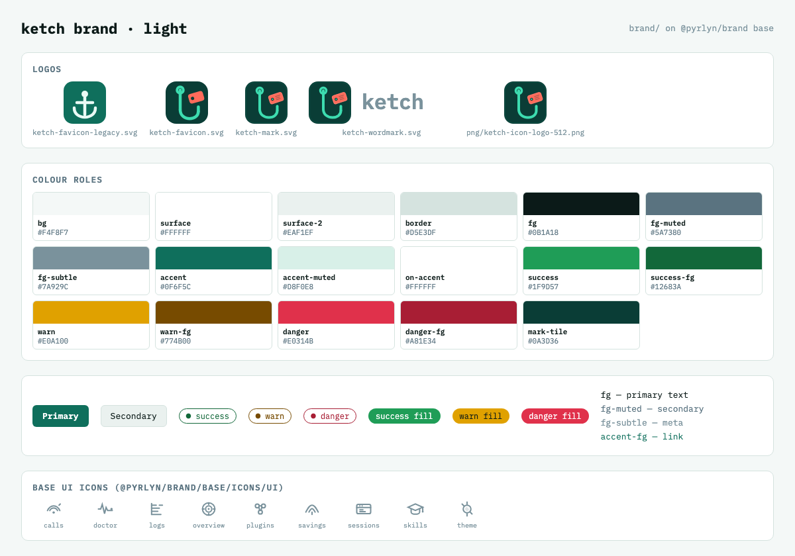
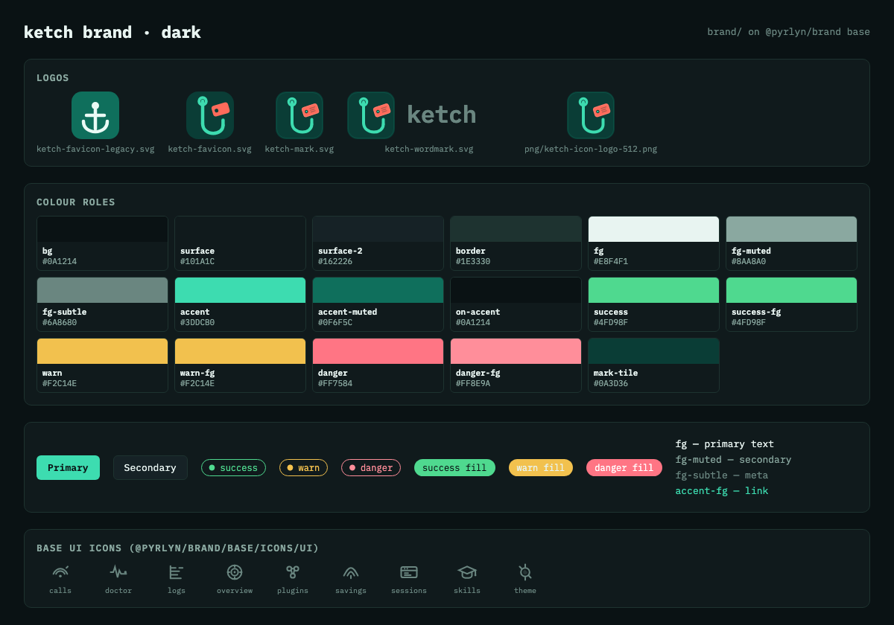

# ketch brand

This folder is the **source of truth for the ketch brand**: logos, colour tokens and the brandbook (`DESIGN.md`) of the ketch site. It holds only what is
specific to ketch. Everything the Pyrlyn products share (type scale, spacing, radii, sizes,
breakpoints, motion, the semantic colour roles, IBM Plex Mono, the UI icons and the `.pyr-*`
components) is the **Pyrlyn base layer** in [pyrlyn/brand](https://github.com/pyrlyn/brand) `base/`,
and this pack inherits it instead of copying it.

## Inheritance: base from pyrlyn/brand, ketch deltas here

| Layer | Lives in | Provides |
|---|---|---|
| Base | [pyrlyn/brand `base/`](https://github.com/pyrlyn/brand/tree/v0.3.0/base), installed as `@pyrlyn/brand` | tokens (`--pyr-*` scales), the list of colour roles and their fallbacks, fonts, UI icons, components |
| ketch | this folder | the colour roles per theme (`--pyr-bg`, `--pyr-accent` …), ketch's own tokens (`--ketch-*`), logos |

- `package.json` pins the base: `"@pyrlyn/brand": "github:pyrlyn/brand#v0.3.0"`;
  `package-lock.json` locks it to commit `b42ec5b`.
- `tokens.json` has `"$extends": "@pyrlyn/brand/base/tokens.json"` and only sets ketch's values.
- `node build.mjs` merges the two and writes `dist/tokens.css`, which starts with
  `@import "@pyrlyn/brand/base/tokens.css";` and then sets the roles, plus `dist/tokens.resolved.json`.
- No base file or value is copied into this folder. Roles ketch leaves empty use the base fallback
  (listed in the table below).

**Where to change what.** ketch colours, logos and `DESIGN.md`: here, in a ketch PR.
Shared tokens, fonts, UI icons, components or the role list: in pyrlyn/brand `base/` first, then bump the
tag in `package.json`, run `npm install` and `node build.mjs` here.

**Origin.** Imported from pyrlyn/brand v0.3.0 `brands/ketch/`. The pack now lives in this repo;
pyrlyn/brand drops `brands/*` in its next release and keeps `base/` unchanged, so the v0.3.0 pin stays
valid until a newer base is needed.

## Use

```sh
cd brand && npm ci          # installs the pinned @pyrlyn/brand into brand/node_modules
npm run build               # regenerate dist/ and the token table below
npm run check               # CI-style check: exit 1 if dist/ or the table is stale
```

In a bundler (Vite, PostCSS, Tailwind v4, esbuild) import the ketch tokens, then the base fonts and,
if wanted, the base components; the bare `@pyrlyn/brand/…` specifiers resolve through
`brand/node_modules`:

```css
@import "<path to>/brand/dist/tokens.css";   /* base tokens + ketch roles (--pyr-*) + --ketch-* */
@import "@pyrlyn/brand/base/fonts.css";      /* IBM Plex Mono */
@import "@pyrlyn/brand/base/components.css"; /* .pyr-btn, .pyr-chip … in ketch colours */
```

Plain HTML has no module resolution: link `brand/node_modules/@pyrlyn/brand/dist/base/tokens.css`
before `brand/dist/tokens.css`. UI icons: `@pyrlyn/brand/base/icons/ui/*.svg` (ketch has no icons of its own).

Light is ketch's default theme; dark is first-class.


## Layout

```text
brand/
  package.json, package-lock.json  pins @pyrlyn/brand (base) to v0.3.0
  tokens.json      ketch roles + --ketch-* extras, extends @pyrlyn/brand/base/tokens.json
  build.mjs        -> dist/tokens.css, dist/tokens.resolved.json, the table below
  DESIGN.md        ketch brandbook (deltas only)
  logo/ (+png/)    mark, wordmark, favicon (+ legacy favicon); PNG exports
  preview/         light/dark preview PNGs
```

## Tokens

<!-- BEGIN TOKEN TABLE (generated by build.mjs, do not edit) -->
Base: `@pyrlyn/brand` 0.3.0 (`github:pyrlyn/brand#v0.3.0`). AA = lowest contrast of a text role on `bg`, `surface` and
`surface-2` (`on-accent`: on `accent`); ✓ ≥ 4.5:1. Roles without a value use the base fallback shown.

Brand constants: `--ketch-brand-teal` `#0A3D36` · `--ketch-brand-mint` `#3DDCB0` · `--ketch-brand-coral` `#FF6B5B`

| Role | CSS variable | light (default) | light AA | dark | dark AA |
|---|---|---|---|---|---|
| `bg` | `--pyr-bg` | `#F4F8F7` |  | `#0A1214` |  |
| `surface` | `--pyr-surface` | `#FFFFFF` |  | `#101A1C` |  |
| `surface-2` | `--pyr-surface-2` | `#EAF1EF` |  | `#162226` |  |
| `border` | `--pyr-border` | `#D5E3DF` |  | `#1E3330` |  |
| `fg` | `--pyr-fg` | `#0B1A18` | 15.60 ✓ | `#E8F4F1` | 14.44 ✓ |
| `fg-muted` | `--pyr-fg-muted` | `#5A7380` | 4.36 ✗ (large text only) | `#8AA8A0` | 6.34 ✓ |
| `fg-subtle` | `--pyr-fg-subtle` | `#7A929C` | 2.86 ✗ | `#6A8680` | 4.13 ✗ (large text only) |
| `accent` | `--pyr-accent` | `#0F6F5C` |  | `#3DDCB0` |  |
| `accent-muted` | `--pyr-accent-muted` | `#D8F0E8` |  | `#0F6F5C` |  |
| `mark-tile` | `--pyr-mark-tile` | `#0A3D36` |  | `#0A3D36` |  |
| `accent-fg` | `--pyr-accent-fg` | `#0F6F5C (base fallback)` | 5.31 ✓ | `#3DDCB0 (base fallback)` | 9.34 ✓ |
| `on-accent` | `--pyr-on-accent` | `#FFFFFF` | 6.09 ✓ | `#0A1214` | 10.87 ✓ |
| `delta-fg` | `--pyr-delta-fg` | `#0F6F5C (base fallback)` | 5.31 ✓ | `#3DDCB0 (base fallback)` | 9.34 ✓ |
| `danger` | `--pyr-danger` | `#E0314B` |  | `#FF7584` |  |
| `danger-fg` | `--pyr-danger-fg` | `#A81E34` | 6.32 ✓ | `#FF8E9A` | 7.43 ✓ |
| `success` | `--pyr-success` | `#1F9D57` |  | `#4FD98F` |  |
| `success-fg` | `--pyr-success-fg` | `#12683A` | 5.98 ✓ | `#4FD98F` | 9.03 ✓ |
| `warn` | `--pyr-warn` | `#E0A100` |  | `#F2C14E` |  |
| `warn-fg` | `--pyr-warn-fg` | `#774B00` | 6.57 ✓ | `#F2C14E` | 9.69 ✓ |
| `shadow-e1` | `--pyr-shadow-e1` | `0 1px 2px rgba(11, 26, 24, 0.04), 0 1px 3px rgba(11, 26, 24, 0.06)` |  | `0 1px 2px rgba(0, 0, 0, 0.35), 0 1px 3px rgba(0, 0, 0, 0.25)` |  |
| `shadow-e2` | `--pyr-shadow-e2` | `0 4px 12px rgba(11, 26, 24, 0.06), 0 1px 3px rgba(11, 26, 24, 0.04)` |  | `0 4px 14px rgba(0, 0, 0, 0.4), 0 1px 3px rgba(0, 0, 0, 0.3)` |  |
| `shadow-e3` | `--pyr-shadow-e3` | `0 12px 32px rgba(11, 26, 24, 0.10), 0 2px 6px rgba(11, 26, 24, 0.05)` |  | `0 16px 40px rgba(0, 0, 0, 0.5), 0 2px 8px rgba(0, 0, 0, 0.35)` |  |
| ketch extra | `--ketch-accent-bright` | `#1FA88A` | | `#5EE8C4` | |
| ketch extra | `--ketch-glass-fill` | `rgba(255, 255, 255, 0.72)` | | `rgba(16, 26, 28, 0.72)` | |
| ketch extra | `--ketch-glass-border` | `rgba(213, 227, 223, 0.9)` | | `rgba(30, 51, 48, 0.9)` | |
| ketch extra | `--ketch-focus-ring` | `0 0 0 3px rgba(15, 111, 92, 0.35)` | | `0 0 0 3px rgba(61, 220, 176, 0.4)` | |
| ketch extra | `--ketch-tag-coral` | `#FF6B5B` | | `#FF6B5B` | |
| ketch extra | `--ketch-stage` | `#E8F2EE` | | `#0C1614` | |
| ketch extra | `--ketch-term-bg` | `#0A1214` | | `#060C0E` | |
| ketch extra | `--ketch-term-surface` | `#101A1C` | | `#0A1214` | |
| ketch extra | `--ketch-term-ink` | `#E8F4F1` | | `#E8F4F1` | |
| ketch extra | `--ketch-term-dim` | `#8AA8A0` | | `#8AA8A0` | |
| ketch extra | `--ketch-term-accent` | `#3DDCB0` | | `#3DDCB0` | |
| ketch extra | `--ketch-term-hairline` | `#1E3330` | | `#1E3330` | |
<!-- END TOKEN TABLE -->

## Changes since pyrlyn/brand v0.3.0 `brands/ketch`

- `tokens.json` extends `@pyrlyn/brand/base/tokens.json` (was `../../base/tokens.json`).
- **Status colours added** (ketch had none, so the base fell back to `fg`): `success`, `warn`, `danger`
  and their `*-fg` text variants in both themes, taken from the ketch desktop app's status tokens
  (`desktop/design/tokens.json` `status.*`) so the site and the app agree. Every `*-fg` passes WCAG AA
  on `bg`, `surface` and `surface-2` (table below).
- New `package.json` / `package-lock.json` (base pin), `build.mjs` and `dist/` (the build moved here from
  pyrlyn/brand; before the status colours were added the output was identical to v0.3.0
  `dist/brands/ketch/`).
- `DESIGN.md`: base links point at pyrlyn/brand v0.3.0; status colours documented.

## Checked against the product

- `logo/ketch-mark.svg`, `ketch-wordmark.svg`, `ketch-favicon.svg`, `ketch-favicon-legacy.svg` are
  byte-identical to `site/static/img/logo.svg`, `logo-wordmark.svg`, `favicon.svg`, `favicon.legacy.svg`.
- The colour roles were taken from `site/static/css/main.css` at `7bec33c`, which is still current `main`.

## Known gaps

- The macOS / Windows / Linux desktop apps keep their own token system (`desktop/design/`, blue accent,
  platform-native surfaces); this pack is the web/site brand and only borrows the status colours.
- `fg-muted` (light `#5A7380`, 4.36:1 on `surface-2`) and `fg-subtle` (light `#7A929C`, 2.86:1; dark
  `#6A8680`, 4.13:1) are the site's own values and were left unchanged; they fall below AA for body text
  on some grounds (table above). Raise them in a follow-up if they carry essential text.
- The light `warn` fill `#E0A100` is 2.12:1 on `bg`: use it with an outline or an `fg` label (7.89:1),
  never as text (use `warn-fg`).
- The site's font stack starts with JetBrains Mono; the base ships IBM Plex Mono (see `DESIGN.md`).
- Nothing in ketch imports this folder yet; the site still uses `site/static/css/main.css` and
  `site/static/img/`.

## Preview

| Light | Dark |
|---|---|
|  |  |
